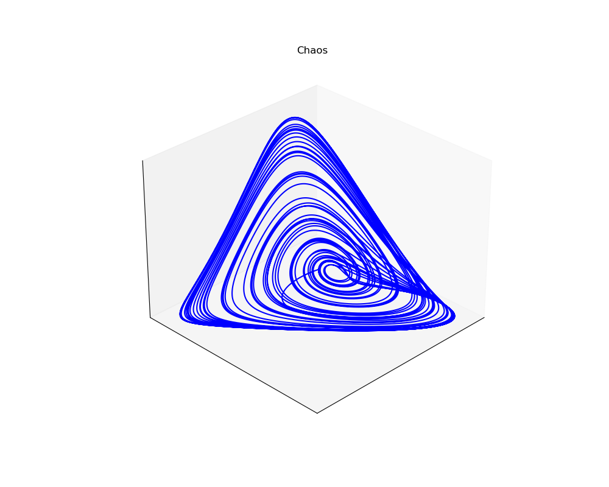

**Lotka-Volterra Equations**

These equations model the population of a number of species interacting with each other, for example a prey and a predator. Different visualizations for a 2 and 3 species system are created (.ipynb-file). A parameter set for the 3 species system which shows chaotic behaviour is presented. The visualization are part of a poster (.pdf-file). 

Phase plane of a 3 species system with chaotic behaviour:

